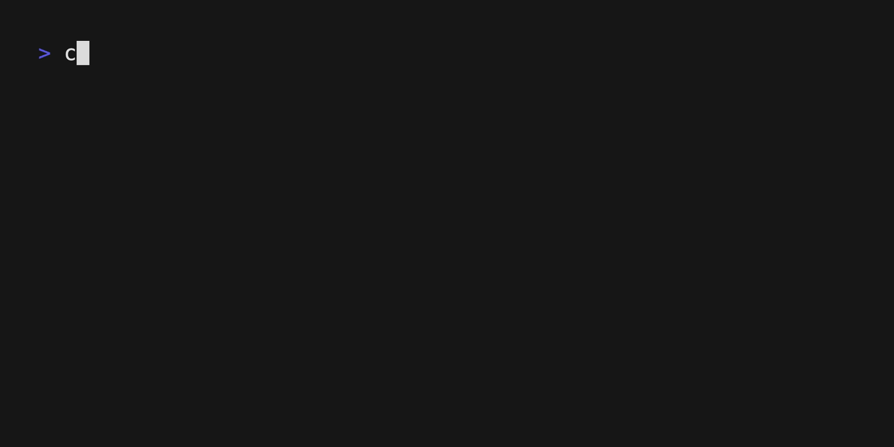
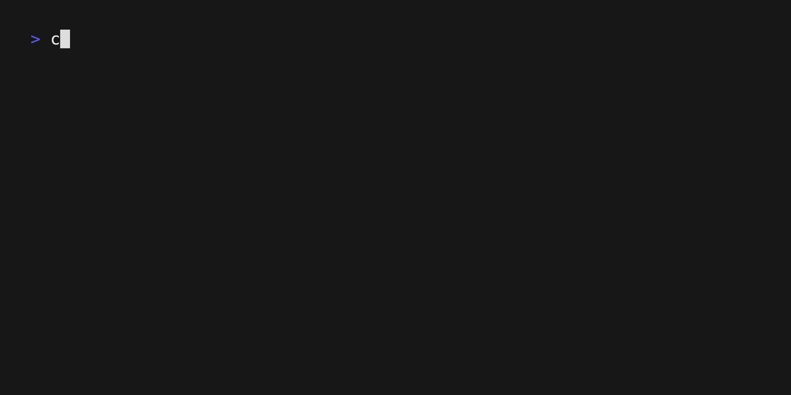

<!-- omit in toc -->
# canvas-sync

CLI to download (course files, videos, etc) & view (deadlines, events, announcements) from [Canvas](https://www.instructure.com/canvas)

<!-- omit in toc -->
## Contents

- [Install](#install)
  - [Brew (mac/linux/wsl)](#brew-maclinuxwsl)
  - [Scoop (windows)](#scoop-windows)
  - [Autocomplete (mac/linux/wsl)](#autocomplete-maclinuxwsl)
    - [zsh](#zsh)
    - [bash](#bash)
    - [fish (not necessary if you installed fish via homebrew)](#fish-not-necessary-if-you-installed-fish-via-homebrew)
  - [Updating](#updating)
    - [Brew](#brew)
    - [Scoop](#scoop)
- [Set-up](#set-up)
- [Config](#config)
- [Commands](#commands)
  - [Init](#init)
  - [Pull](#pull)
    - [Pull Files](#pull-files)
    - [Pull Videos](#pull-videos)
  - [Update](#update)
    - [Update Files](#update-files)
    - [Update Videos](#update-videos)
  - [View](#view)
    - [View Deadlines (assignments)](#view-deadlines-assignments)
    - [View Events (Announcements/lectures/tutorials)](#view-events-announcementslecturestutorials)
    - [View People (from a given course)](#view-people-from-a-given-course)
- [LICENSE](#license)

## Install

### Brew (mac/linux/wsl)

Brew is a package manager for macOS (or linux) that helps you install packages easily - more info [here](https://brew.sh/)

To install Brew:

```bash
/bin/bash -c "$(curl -fsSL https://raw.githubusercontent.com/Homebrew/install/HEAD/install.sh)"
```

To install canvas-sync with Brew:

```bash
brew install aidanaden/tools/canvas-sync
```

### Scoop (windows)

Scoop is a package manager for windows that helps you install programs from the command line (Brew but for windows) - more info [here](https://scoop.sh/)

To install Scoop, launch powershell and run:

```bash
Set-ExecutionPolicy RemoteSigned -Scope CurrentUser
irm get.scoop.sh | iex
```

To install canvas-sync with Scoop:

```bash
scoop bucket add scoop-bucket https://github.com/aidanaden/scoop-bucket.git
scoop install canvas-sync
```

You can also download directly from the [releases](https://github.com/aidanaden/canvas-sync/releases) page

### Autocomplete (mac/linux/wsl)

*Warning: skip if you don't know what zsh is*

Adds autocompletion for canvas-sync to your shell.

#### zsh

<details>
  <summary>
    Code for zsh autocomplete
  </summary>

  ```bash
  echo "\n\nif type brew &>/dev/null
  then
    FPATH="$(brew --prefix)/share/zsh/site-functions:${FPATH}"

    autoload -Uz compinit
    compinit
  fi" >> ~/.zshrc && source ~/.zshrc

  ```

</details>

#### bash

<details>
  <summary>
    Code for bash autocomplete (replace "~/.bash_profile" with your bash config file)
  </summary>

  ```bash
  echo "if type brew &>/dev/null
  then
    HOMEBREW_PREFIX="$(brew --prefix)"
    if [[ -r "${HOMEBREW_PREFIX}/etc/profile.d/bash_completion.sh" ]]
    then
      source "${HOMEBREW_PREFIX}/etc/profile.d/bash_completion.sh"
    else
      for COMPLETION in "${HOMEBREW_PREFIX}/etc/bash_completion.d/"*
      do
        [[ -r "${COMPLETION}" ]] && source "${COMPLETION}"
      done
    fi
  fi" >> ~/.bash_profile && source ~/.bash_profile
  ```

</details>

#### fish (not necessary if you installed fish via homebrew)

<details>
  <summary>
    Code for fish autocomplete
  </summary>

  ```bash
  echo "if test -d (brew --prefix)"/share/fish/completions"
      set -gx fish_complete_path $fish_complete_path (brew --prefix)/share/fish/completions
  end

  if test -d (brew --prefix)"/share/fish/vendor_completions.d"
      set -gx fish_complete_path $fish_complete_path (brew --prefix)/share/fish/vendor_completions.d
  end" >> ~/.config/fish/config.fish && source ~/.config/fish/config.fish
  ```

</details>

### Updating

#### Brew

If installed using brew, simply run:

```bash
brew update && brew upgrade
```

#### Scoop

If installed using scoop, simply run:

```bash
scoop update; scoop update canvas-sync
```

You can also download the latest version directly from the [releases](https://github.com/aidanaden/canvas-sync/releases) page

## Set-up

To set up canvas-sync, run the `init` command:

```bash
canvas-sync init
```

1. First, enter the directory to store all downloaded canvas data (files, videos, etc) e.g. `$HOME/Desktop/canvas`, if left blank all downloaded data will be stored in `$HOME/canvas-sync/data`
2. Next, enter your school's canvas website url, if left blank it'll be set to `https://canvas.nus.edu.sg` (i'm from nus after all)
3. You'll be asked for your username and password to log in to canvas **(no other command requires login)**
4. After logging in, your config will be successfully created and all other commands will work, check them out [here](#commands)

## Config

All configuration is done in the `$HOME/canvas-sync/config.yaml` file.

3 values can be configured:

- `access_token`: token generated by the canvas user (you) to download from canvas directly, if not filled canvas-sync will prompt you to log in
- `data_dir`: directory to store downloaded canvas data, defaults to `$HOME/canvas-sync/data`  
- `canvas_url`: URL of your target canvas site, defaults to `https://canvas.nus.edu.sg`

To create a default config file, run `canvas-sync init`

## Commands

### Init

Creates a new config file in the default directory `$HOME/canvas-sync`



### Pull

Downloads data (files, videos, etc) from canvas, overwrites all existing data

#### Pull Files

View documentation via `pull files -h`:


#### Pull Videos

WIP

### Update

Updates downloaded data (files, videos, etc) from canvas

#### Update Files

View documentation via `update files -h`:


#### Update Videos

WIP

### View

Display data from canvas (deadlines, events, announcements, etc)

#### View Deadlines (assignments)

Display past/future assignment deadlines


#### View Events (Announcements/lectures/tutorials)

Display past/future lectures/announcements



#### View People (from a given course)

Display people from a given course code


## LICENSE

MIT
